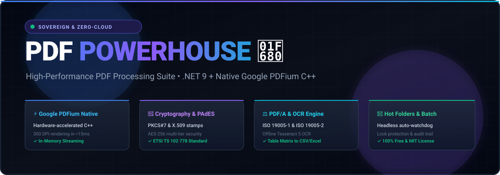
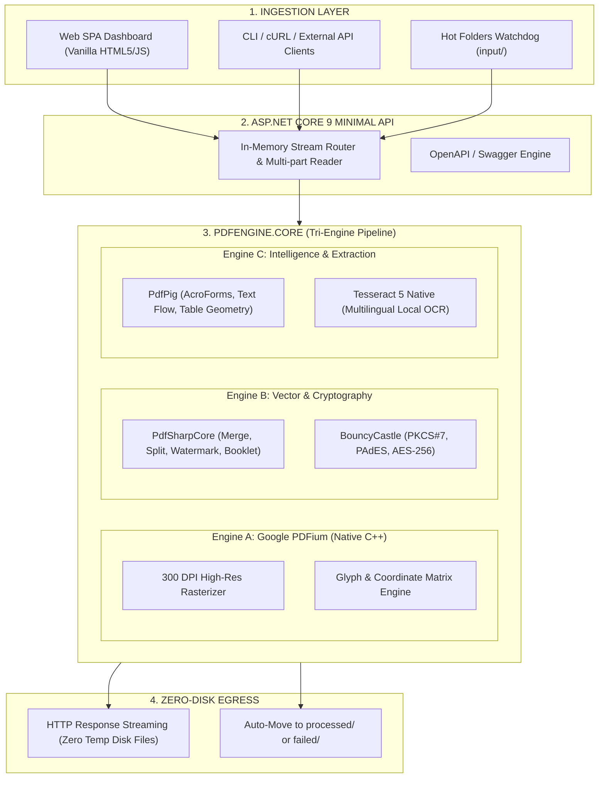

# PDF POWERHOUSE 🚀

<div align="center">



<br/>

[](https://github.com/jdelavega23/pdf-powerhouse/actions)


**High-Performance, Sovereign & Privacy-First PDF Processing Engine & REST API**  
*100% On-Premise & Local Memory Streaming • Zero Cloud Tracking • Zero Subscription Fees*

Designed & Engineered by **Juan Manuel de la Vega** ([@jdelavega23](https://github.com/jdelavega23))

[Download v1.0.0](https://github.com/jdelavega23/pdf-powerhouse/releases/latest) • [🌐 Live Interactive Architecture](https://jdelavega23.github.io/pdf-powerhouse/) • [Quickstart](#-quickstart) • [Usage Examples](#-direct-usage-examples) • [Why PDF Powerhouse?](#-why-pdf-powerhouse-the-killer-comparison) • [Architecture Deep-Dive](#-architecture-deep-dive) • [cURL Cheat Sheet](#-developer--curl-cheat-sheet)

</div>

---

## ⚡ Vision & Philosophy

Tired of abusive subscription fees ($25/mo to Adobe Acrobat or ILovePDF) and uploading sensitive personal, legal, or medical documents to third-party cloud servers?

**PDF Powerhouse** is an open-source, enterprise-grade PDF suite engineered for **absolute local privacy (GDPR / HIPAA compliant)** and blazing speed. All operations are executed directly in RAM using native C++ Google PDFium and .NET 9, leaving zero file traces behind.

---

## 🚀 Quickstart

Choose your preferred way to run PDF Powerhouse:

### 1. 💻 Desktop User (1-Click Standalone)
No installation or programming knowledge needed:
1. Download **[`PDF_Powerhouse_v1.0.0_win-x64.zip`](https://github.com/jdelavega23/pdf-powerhouse/releases/latest)**.
2. Extract the ZIP to any folder.
3. Double-click `Iniciar_PDF_Powerhouse.bat`.
4. Your browser will instantly open at **`http://localhost:5000`** with the full interactive dashboard.

### 2. 🐳 Docker & Homelab (Self-Hosted)
Deploy with a single command on your Linux server, NAS, or homelab:
```bash
docker-compose up -d --build
```
* **Interactive Web App**: `http://localhost:5000`
* **Swagger API Explorer**: `http://localhost:5000/swagger`

### 3. 🛠️ .NET Developer (Build from Source)
Requires [.NET 9 SDK](https://dotnet.microsoft.com/download/dotnet/9.0):
```bash
git clone https://github.com/jdelavega23/pdf-powerhouse.git
cd pdf-powerhouse
dotnet test tests/PdfEngine.Tests/PdfEngine.Tests.csproj
dotnet run --project src/PdfEngine.Api/PdfEngine.Api.csproj
```

---

## 🎯 Direct Usage Examples

### Example 1: Web Interface (No-Code Workflow)
1. **Open the Dashboard**: Navigate to `http://localhost:5000`.
2. **Select Tool**: Click on **Merge**, **Sign**, **PDF/A**, or **OCR** in the left sidebar.
3. **Drag & Drop**: Drop your PDF files into the upload zone.
4. **Configure Options**: Adjust settings (e.g., select certification level, watermark opacity, or OCR languages `spa+eng`).
5. **Instant Result**: The output is streamed immediately from RAM to your browser for instant download.

---

### Example 2: Python Script (Automated Batch Processing)
You can integrate PDF Powerhouse into existing data pipelines in just 5 lines of Python:

```python
import requests

# 1. Merge multiple documents via REST API
url = "http://localhost:5000/api/pdf/merge"
files = [
    ("files", open("invoice_page1.pdf", "rb")),
    ("files", open("invoice_page2.pdf", "rb"))
]

response = requests.post(url, files=files)
with open("combined_invoice.pdf", "wb") as f:
    f.write(response.content)

print("Merged successfully without third-party cloud!")
```

---

### Example 3: C# Service Integration (.NET)
```csharp
using var httpClient = new HttpClient();
using var form = new MultipartFormDataContent();

var fileStream = File.OpenRead("legal_filing.pdf");
form.Add(new StreamContent(fileStream), "file", "legal_filing.pdf");
form.Add(new StringContent("PDF_A_2b"), "standard");

var response = await httpClient.PostAsync("http://localhost:5000/api/pdf/pdfa/convert", form);
var pdfaBytes = await response.Content.ReadAsByteArrayAsync();
await File.WriteAllBytesAsync("court_compliant_filing.pdf", pdfaBytes);
```

---

## 🥊 Why PDF Powerhouse? (The Killer Comparison)

| Capability | 🚀 **PDF Powerhouse** | 🏢 **Adobe Acrobat Pro** | ☁️ **ILovePDF / Smallpdf** |
| :--- | :---: | :---: | :---: |
| **Pricing** | 🟢 **$0 (Free & MIT Open Source)** | 🔴 \$239.88 / year | 🔴 \$72.00 / year |
| **Privacy & Security** | 🟢 **100% In-Memory RAM (Zero Telemetry)** | 🟡 Cloud Sync & Telemetry | 🔴 Uploaded to Cloud Servers |
| **Core Engine** | ⚡ **Google PDFium C++ (Chrome Engine)** | Heavy Proprietary Native | Slow Web Server Queue |
| **Digital Signatures** | 🟢 **PKCS#7 / PAdES (X.509 certs + stamps)** | 🟡 Paid Tier | 🔴 Paid / External e-Sign |
| **Offline OCR** | 🟢 **Local Tesseract 5 (Multi-language)** | 🟡 Desktop only | 🔴 Cloud Processing Only |
| **PDF/A Judicial Standard** | 🟢 **ISO 19005-1 & 19005-2 built-in** | 🟡 Included | 🔴 Paid feature |
| **Table Extraction** | 🟢 **Direct export to CSV / Excel** | 🟡 Included | 🔴 Limited free credits |
| **Unattended Hot Folders** | 🟢 **Headless Watchdog Service** | 🔴 Enterprise License only | ❌ Not available |
| **REST API / Headless** | 🟢 **Ready for Docker / Homelabs** | 🔴 Expensive Adobe PDF Services API | 🔴 Metered API per credit |

---

## 🧱 Architecture Deep-Dive

PDF Powerhouse is built with a decoupled clean architecture designed for maximum throughput, resilience, and strict data privacy.

> 🌐 **Explore the Live Interactive Architecture**:  
> Open the animated pipeline directly in your browser: **[https://jdelavega23.github.io/pdf-powerhouse/](https://jdelavega23.github.io/pdf-powerhouse/)**  
> *(Features interactive scenario simulations, live memory inspection, and engine performance benchmarks. When running locally, it is also available at `http://localhost:5000/architecture.html`).*



### 1. The Tri-Engine Synergy
Rather than relying on a single monolithic library that compromises on performance or capability, PDF Powerhouse orchestrates three specialized engines:
* **Google PDFium C++ (via Docnet.Core)**: The identical, battle-tested native rendering core powering Google Chrome. Used for hardware-accelerated 300 DPI rasterization, thumbnail generation, and pixel-perfect previews.
* **PdfSharpCore & BouncyCastle**: Lightweight in-memory document synthesis. Performs page tree concatenation, rotation, vector watermarking, and cryptographically sound PKCS#7 / PAdES signing with X.509 certificates.
* **UglyToad PdfPig & Tesseract 5**: Deep structural inspection engine that traverses the PDF object model to read AcroForms, compute word bounding boxes for table reconstruction, and pipe pre-processed bitmaps into native Tesseract OCR.

### 2. In-Memory Zero-Disk Security Model
Most PDF utilities write unencrypted intermediate `.tmp` files to disk during operations like OCR or format conversion. PDF Powerhouse enforces an **in-memory streaming contract**:
* Incoming files are ingested as non-buffered memory streams.
* Transformations occur directly in RAM buffers.
* Output is streamed directly to the HTTP response pipeline.
* **Result**: Zero data leakage, zero disk clutter, and instantaneous compliance with GDPR, HIPAA, and sensitive internal data policies.

### 3. Headless Hot Folders Engine
For offices, law firms, and homelab automation:
* A background `IHostedService` continuously monitors the `hotfolders/input/` directory using file system notifications.
* **Debounce & Lock Protection**: Employs an exponential-retry mechanism to ensure files copied from network scanners or slow transfers are fully written before processing begins.
* Automatically processes jobs according to preset rules (e.g., auto-convert to PDF/A and OCR) and cleanly routes results to `hotfolders/processed/` or `hotfolders/failed/` with forensic audit logs.

---

## 💻 Developer & cURL Cheat Sheet

Automate your documents from scripts, bash, Python, or homelab automation:

#### 1. Merge multiple PDFs:
```bash
curl -X POST "http://localhost:5000/api/pdf/merge" \
  -F "files=@document1.pdf" \
  -F "files=@document2.pdf" \
  --output merged.pdf
```

#### 2. Convert to PDF/A (Court & Government Standard):
```bash
curl -X POST "http://localhost:5000/api/pdf/pdfa/convert" \
  -F "file=@invoice.pdf" \
  -F "standard=PDF_A_2b" \
  --output compliant_archive.pdf
```

#### 3. Extract Tables to CSV:
```bash
curl -X POST "http://localhost:5000/api/pdf/tables/extract-csv" \
  -F "file=@financial_report.pdf" \
  --output report_tables.csv
```

#### 4. Run Offline OCR:
```bash
curl -X POST "http://localhost:5000/api/pdf/ocr" \
  -F "file=@scanned_receipt.pdf" \
  -F "languages=spa+eng" \
  --output searchable.pdf
```

---

## ✨ Complete Feature Matrix

- **Blazing Native Rendering**: Official **Google PDFium C++** (x64) bindings render pages to PNG in milliseconds with ultra-crisp resolution.
- **Document Manipulation**:
  - `Merge`: Ultra-fast PDF concatenation preserving vector graphics, bookmarks, and fonts.
  - `Split`: Automatic splitting into single pages or ranges, with instant `.ZIP` packaging.
  - `Extract`: Surgical page extraction by custom ranges (e.g. `1-3, 5, 8-10`).
  - `Rotate`: 90°, 180°, 270° orientation correction (per page or whole document).
  - `Watermark`: Vector watermark overlay with customizable font, angle, opacity, and color.
- **Security & Integrity**:
  - `Protect`: Multi-level password encryption (User / Owner) with granular permission flags (printing, copying, annotations).
  - `Unlock`: Permission stripping and decryption.
  - `Sign`: PKCS#7 / PAdES digital signatures with X.509 certificates (`.pfx` / `.p12`), visual cryptographic stamps, and self-signed certificate generator.
- **Advanced Engineering**:
  - `PDF/A Validator & Converter`: Official ISO 19005-1 / ISO 19005-2 compliance for judicial and public administration submissions.
  - `Local OCR`: Native Tesseract 5 engine (300 DPI pre-render + multilingual recognition with automatic model downloads).
  - `Doctor PDF`: Structural diagnosis and automated repair of corrupted streams.
  - `Office Converter`: Universal conversion of Office documents (`.docx`, `.xlsx`, `.pptx`, `.csv`, `.txt`, `.rtf`) to vector PDF.
  - `Table Extractor`: Intelligent table boundary detection with export to structured CSV / Excel.
  - `Hot Folders`: Background watchdog service for unattended directory processing (`input/` ➔ `processed/` or `failed/`).
  - `Batch Studio`: Concurrent multi-threaded processing with ZIP packaging and forensic audit reports.

---

## 🗺️ Roadmap & Milestones

- [x] **Phase 1**: Core C# Engine + Google PDFium + REST API + Web Dashboard + Tests.
- [x] **Phase 2**: PKCS#7 / PAdES Digital Signatures (`.pfx` / `.p12` certificates & visual stamps).
- [x] **Phase 3**: Native Tesseract 5 OCR (300 DPI rendering + multilingual auto-model fetch).
- [x] **Phase 4**: Doctor PDF (structural repair), Booklet / 2-Up Imposition, AcroForms inspector.
- [x] **Phase 5**: Batch Studio concurrent queue processing with ZIP export.
- [x] **Phase 6**: PDF/A Official Compliance (ISO 19005-1 / ISO 19005-2) for government & courts.
- [x] **Phase 7**: Smart Table Extraction to CSV / Excel.
- [x] **Phase 8**: Universal Office documents to PDF converter.
- [x] **Phase 9**: Hot Folders Watchdog for background headless automation.

---

## 🤝 Contributing

Contributions, issues, and feature requests are welcome!  
Check out our [CONTRIBUTING.md](CONTRIBUTING.md) and [CODE_OF_CONDUCT.md](CODE_OF_CONDUCT.md).

---

## 🔒 Security

For responsible vulnerability reporting, please see [SECURITY.md](SECURITY.md).

---

## 📄 License

This project is licensed under the **MIT License** - see the [LICENSE](LICENSE) file for details.  
Google PDFium, Tesseract, and bundled dependencies retain their respective open-source licenses.

---

<div align="center">
⭐ <b>Star this repository if you believe in free, private and sovereign software!</b> ⭐
</div>
